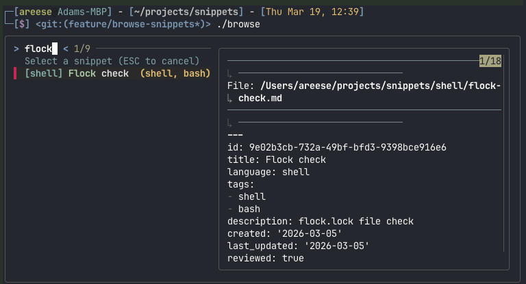

# Snippets

Personal code snippets repository with YAML frontmatter for semantic search and MCP integration.

## Purpose

This repository stores reusable code snippets organized by language, with structured metadata for:

- Fast searching via `fzf` and `ripgrep`
- AI-powered search via built-in MCP server (Claude Desktop and Claude Code)
- Cross-session context preservation

## Quick Start

### Browse Snippets (Recommended)

The fastest way to find a snippet. Fuzzy-match by title, language, or tags with a live preview:

```bash
browse                    # Browse all snippets
browse --language sql     # Pre-filter to SQL only
browse --tag dbt          # Pre-filter by tag
```



### Quick Clipboard Access by UUID

```bash
get 550e8400-e29b-41d4-a716-446655440000       # Copy to clipboard
get --list                                      # List all snippet IDs
```

### Using the TUI

```bash
cd ~/snippets
source venv/bin/activate
.scripts/snippets_tui.py  # Launch unified interface
```

### Using Individual Scripts

**Add a snippet:**

```bash
.scripts/add.py                                      # Interactive
.scripts/add.py --title "My Snippet" --language python --tags "api,rest" \
  --description "API client" --code "import requests..."
```

**Search snippets (structured/programmatic):**

```bash
.scripts/search.py --tag dbt --tag incremental      # By tags
.scripts/search.py --query "SELECT.*JOIN"            # Full-text regex
.scripts/search.py --list-tags                       # Show all tags
```

**Edit snippet:**

```bash
.scripts/edit.py                                     # Select from menu
.scripts/edit.py sql/my-snippet.md                  # Edit specific file
.scripts/edit.py sql/snippet.md --add-tags "new,tags"
```

**Audit metadata:**

```bash
.scripts/audit.py --scan                            # Find issues
.scripts/audit.py --fix-interactive                 # Fix one-by-one
```

## Setup

**Prerequisites:** Python 3.9+, git

### Install Dependencies

**Option 1: Using uv (recommended, faster)**

```bash
# Install uv (modern Python package manager)
curl -LsSf https://astral.sh/uv/install.sh | sh

# Install dependencies
uv pip install -r requirements.txt
```

**Option 2: Using pip**

```bash
# Create virtual environment
python3 -m venv venv
source venv/bin/activate

# Install dependencies
pip install -r requirements.txt
```

### Make Scripts Executable

```bash
chmod +x .scripts/*.py
```

### Shell Setup

The wrapper scripts (`browse`, `get`, `search`, `snippets`, `notes`) are designed to be run from anywhere. Add the repo to your `PATH` so you can call them without `./`:

```bash
# Add to ~/.zshrc or ~/.bashrc
export PATH="$HOME/snippets:$PATH"
```

Or set up individual aliases:

```bash
# Core commands
alias browse='~/snippets/browse'
alias b='~/snippets/browse'        # Short alias for quick access
alias get='~/snippets/get'
alias g='~/snippets/get'
alias search='~/snippets/search'
alias s='~/snippets/search'
alias notes='~/snippets/notes'
alias snippets='cd ~/snippets && ./snippets'

# One-shot aliases for frequently used snippets
alias my-query='get 550e8400-e29b-41d4-a716-446655440000'
alias my-script='get 123e4567-e89b-12d3-a456-426614174000'
```

## Directory Structure

```
~/snippets/
├── sql/         # SQL queries, DDL, dbt models
├── python/      # Python functions, classes, utilities
├── shell/       # Bash/zsh scripts and one-liners
├── config/      # Config file snippets (YAML, TOML, JSON)
├── prompts/     # AI prompts and templates (markdown, text)
└── .scripts/    # Automation scripts
```

### Language to Directory Mapping

When you add a snippet, the `language` field determines which directory it's saved to:

| Language                        | Directory  |
| ------------------------------- | ---------- |
| `sql`                           | `sql/`     |
| `python`                        | `python/`  |
| `shell`, `bash`, `sh`           | `shell/`   |
| `yaml`, `yml`, `toml`, `json`   | `config/`  |
| `markdown`, `md`, `text`, `txt` | `prompts/` |

**Adding a new language/directory:**

1. Edit `.scripts/common.py`:
   - Add to `SUPPORTED_LANGUAGES` list
   - Add to `LANGUAGE_DIRECTORY_MAP` dictionary
2. Create the directory: `mkdir <new-directory>`
3. If using sync-template.sh, update it to include the new directory

**Unknown languages:** If you use a language not in the map, it will warn but still create a directory named after that language (e.g., `rust` → `rust/`).

## Conventions

### One Concept Per File

- Each file contains a single, focused code snippet
- Use descriptive filenames: `dbt-incremental-model.md`, `postgres-backup-script.md`
- File extension is always `.md` regardless of code language (for consistent tooling)

### Required Frontmatter

Every snippet file **must** include this YAML frontmatter:

```yaml
---
id: 550e8400-e29b-41d4-a716-446655440000 # UUID4 (auto-generated by add.py)
title: "Descriptive title for the snippet"
language: "sql" # sql | python | shell | yaml | toml | markdown | text
tags: [dbt, incremental] # Keywords for filtering and search
vars: [SCHEMA, TABLE_NAME] # Optional: variable names for interpolation
runnable: true # Optional: allow execution via --run (shell only)
gist: true # Optional: opt-in for GitHub Gist publishing
gist_id: 5b0e0062eb8e... # Auto-written after first publish
gist_url: https://gist.github.com/... # Auto-written after first publish
description: "One-sentence natural language description for AI semantic search"
created: "2026-03-05" # YYYY-MM-DD format
last_updated: "2026-03-05" # YYYY-MM-DD format (auto-updated by edit.py)
reviewed: true # Optional: set to true after human review
---
```

**Fields explained:**

- `id`: Unique UUID4 identifier for quick clipboard access via `get` command (auto-generated)
- `title`: Human-readable title for the snippet
- `language`: Primary language of the code (used for syntax highlighting and organization)
- `tags`: Array of keywords for filtering (lowercase, hyphen-separated)
- `vars`: Optional list of variable names for `{{VAR}}` placeholder interpolation (see [Variable Interpolation](#variable-interpolation))
- `runnable`: Optional boolean that marks a shell snippet as executable via `get --run`. Only valid for `language: shell` snippets. Requires user confirmation before execution, and destructive patterns (rm -rf, DROP TABLE, etc.) are blocked.
- `gist`: Optional boolean that opts a snippet in for GitHub Gist publishing via the `gist` command
- `gist_id`: Auto-populated gist identifier after first publish (do not edit manually)
- `gist_url`: Auto-populated gist URL after first publish (do not edit manually)
- `description`: Natural language explanation of what the snippet does (optimized for AI search)
- `created`: Date snippet was added to the repository
- `last_updated`: Date snippet was last modified (automatically updated by `edit.py`)
- `reviewed`: Whether this snippet has been reviewed for accuracy (optional for manually added snippets)

### Code Content

After the frontmatter, include:

- The raw code snippet (no surrounding prose)
- Optional inline comments within the code
- No explanatory paragraphs or headers

**Example:**

```markdown
---
id: 550e8400-e29b-41d4-a716-446655440000
title: "dbt incremental model with soft deletes"
language: "sql"
tags: [dbt, incremental, snowflake, soft-delete]
description: "dbt incremental materialization pattern that handles soft-deleted records using is_incremental() macro"
created: "2026-03-05"
last_updated: "2026-03-05"
reviewed: true
---

{{
    config(
        materialized='incremental',
        unique_key='id',
        on_schema_change='fail'
    )
}}

WITH source AS (
SELECT \*
FROM {{ ref('stg_users') }}

WHERE updated_at > (SELECT MAX(updated_at) FROM {{ this }})
OR deleted_at > (SELECT MAX(updated_at) FROM {{ this }})

)

SELECT \*
FROM source
```

### Variable Interpolation

Snippets can act as templates with `{{VAR}}` placeholders. Add a `vars` field to frontmatter listing variable names eligible for interpolation.

Two placeholder formats are supported:

- `{{VAR}}` — replaced if a value is provided, left as-is otherwise
- `{{VAR:default_value}}` — uses `default_value` if no override is provided

```markdown
---
id: 550e8400-e29b-41d4-a716-446655440000
title: "Query by schema"
language: sql
tags: [sql, template]
vars: [SCHEMA, TABLE_NAME, START_DATE]
description: "Parameterized query with schema and date filtering"
created: "2026-03-12"
last_updated: "2026-03-12"
---

SELECT * FROM {{SCHEMA:public}}.{{TABLE_NAME}}
WHERE created_at > '{{START_DATE}}'
```

**Resolution order** (per variable, highest priority first):

1. CLI flag: `--var NAME=value`
2. Environment variable: `os.environ['NAME']`
3. Default value: from `{{VAR:default}}` syntax in the snippet
4. Unresolved: left as `{{NAME}}` in output

**Creating a template snippet:**

```bash
.scripts/add.py \
  --title "Query by Schema" \
  --language sql \
  --tags "sql,template" \
  --vars "SCHEMA,TABLE_NAME,START_DATE" \
  --description "Parameterized query with schema and date filtering" \
  --code "SELECT * FROM {{SCHEMA}}.{{TABLE_NAME}} WHERE created_at > '{{START_DATE}}'"
```

**Retrieving with interpolation:**

```bash
# Env vars resolve automatically
export SCHEMA=public
get <uuid> --print

# Override with CLI flags
get <uuid> --var SCHEMA=staging --var START_DATE=2026-01-01

# Skip interpolation
get <uuid> --raw
```

**Stderr feedback:** When a snippet has `vars`, a resolution summary is printed to stderr (doesn't affect clipboard or piping):

```
Resolved: SCHEMA (env), TABLE_NAME (flag)
Unresolved: START_DATE
```

**dbt/Jinja safety:** Only names listed in `vars` are interpolated. Jinja expressions like `{{ ref('stg_users') }}` are never touched because those names won't be in `vars`.

**Undeclared placeholder hints:** If the output contains `{{UPPER_CASE}}` patterns not listed in `vars`, a stderr hint suggests adding them. Lowercase/mixed-case patterns (Jinja) are ignored.

## Usage


### Command-Line Search

For interactive browsing, use `browse` (see [Quick Start](#quick-start)). For raw text searches, `ripgrep` works well:

```bash
rg -i "incremental" --type md       # Find snippets by keyword
rg "^tags:.*dbt" --type md          # Search within frontmatter
```

### MCP Server Integration

This repository includes a purpose-built [MCP](https://modelcontextprotocol.io/) server that exposes snippet operations as structured tools. Works with both Claude Desktop and Claude Code.

#### How It Works

The MCP server (`.scripts/mcp_server.py`) wraps the same Python functions used by the CLI scripts, exposing them as tools over stdio transport. Claude can search, retrieve, and audit snippets without reading raw files.

**Available tools:**

| Tool | Description |
|------|-------------|
| `search_snippets` | Find snippets by tags, language, terms, regex, or recency |
| `get_snippet` | Retrieve full code + metadata by UUID (with variable interpolation) |
| `list_snippet_ids` | Browse all snippets with UUIDs, titles, languages |
| `list_tags` | Discover all tags with usage counts |
| `audit_snippets` | Health check for metadata issues |

#### Step 1: Install Dependencies

```bash
source venv/bin/activate
pip install -r requirements.txt   # Installs PyYAML + mcp SDK
```

#### Step 2: Configure Claude Desktop

Edit your Claude Desktop config file:

- **macOS**: `~/Library/Application Support/Claude/claude_desktop_config.json`
- **Windows**: `%APPDATA%\Claude\claude_desktop_config.json`

Add a `snippets` entry under `mcpServers`:

```json
{
  "mcpServers": {
    "snippets": {
      "command": "/path/to/your/snippets/mcp_server.sh"
    }
  }
}
```

Replace `/path/to/your/snippets` with the absolute path to this repository.

#### Step 3: Configure Claude Code

The repository includes a `.mcp.json` file that Claude Code picks up automatically. No additional configuration needed — just open a session in the repo directory.

#### Step 4: Restart and Verify

- **Claude Desktop**: Fully quit and relaunch. The `snippets` tools should appear.
- **Claude Code**: Start a new session or use `/mcp` to reload.

You can also test manually:

```bash
# Verify server starts (Ctrl-C to quit)
./mcp_server.sh

# Interactive testing with MCP Inspector
npx @modelcontextprotocol/inspector ./mcp_server.sh
```

#### Example


#### Example Prompts

```
# Find snippets
"Do I have any snippets for flock file locking?"
"Show me all my SQL snippets tagged with 'dbt'"
"Find shell scripts related to backups"

# Retrieve and print snippet content
"Get my QA data load snippet and print it"
"Show me all my QA query snippets"

# Add snippets
"Save this Python function as a snippet — tag it api and retry"
"Add the code I just wrote to my snippets repo"

# Maintain snippets
"Check my snippets for any metadata issues"
"Update the description on my flock snippet"
"Add the tag 'reviewed' to my QA locations snippet"
```

### Espanso Integration (Private Snippets Behind Public Shortcuts)

If you use [espanso](https://espanso.org/) for text expansion and your dotfiles
(which carry your espanso config) are public, you can still bind a short
trigger like `~!cust` to a proprietary snippet — without the snippet's contents
ever leaving this private repo.

**The pattern:** the public espanso config holds only the trigger and the
snippet's UUID. At expansion time, espanso shells out to `get <uuid> --print`,
which emits the snippet body to stdout. The snippet itself stays private.

```yaml
# In your (public) espanso config
- trigger: "~!cust"
  replace: "{{snippet}}"
  vars:
    - name: snippet
      type: shell
      params:
        cmd: "$HOME/projects/personal/snippets/get <uuid-here> --print"
```

**Why this is safe to commit publicly:**

- The UUID is a random opaque identifier — it reveals nothing about the code.
- The path (`$HOME/projects/personal/snippets`) points into the user's private
  tree; anyone without that repo gets an empty expansion, not a leak.
- All proprietary content (table names, schema, business logic) stays in this
  private repo behind frontmatter and git history.

**Typing workflow:** type `~!cust` in any editor → espanso runs `get <uuid>
--print` → snippet body is inserted in place.

## System Paradigm

This repository implements a **script-driven snippet management system** designed for:

### Dual-Mode Operation

- **Interactive Mode**: Menu-driven prompts for human users
- **Programmatic Mode**: JSON/CLI arguments for AI agents (Claude Code)

### Metadata-First Design

Every snippet includes structured YAML frontmatter for:

- **Semantic search**: AI-optimized descriptions
- **Filtering**: Tags, language, date range
- **Organization**: Automatic directory routing
- **Tracking**: Creation and update timestamps

### Script-Based CRUD

- **Create**: `add.py` - Interactive or programmatic snippet creation
- **Read**: `search.py` - Multi-filter search with previews
- **Update**: `edit.py` - Metadata editing with auto-timestamping
- **Delete**: Manual deletion (use `git rm`)
- **Audit**: `audit.py` - Metadata completeness scanning

### Git-Integrated

All operations prompt before committing (in interactive mode):

- `feat(language): add <title>` - New snippets
- `chore(language): update <filename> metadata` - Edits

### AI-Friendly

- **MCP Integration**: Built-in MCP server with search, retrieval, and audit tools
- **JSON Output**: All scripts support `--format json`
- **Structured Metadata**: Searchable by AI agents
- **Clear Conventions**: Consistent patterns across all scripts

## Scripts Reference

### `snippets_tui.py` - Unified Terminal Interface

Menu-driven access to all snippet operations.

**Usage:**

```bash
.scripts/snippets_tui.py
```

**Menu Options:**

- [a] Add new snippet
- [s] Search snippets
- [e] Edit snippet
- [d] Delete snippet
- [r] Recent snippets
- [b] Browse all
- [t] Tag management
- [u] Audit metadata
- [i] Info/stats
- [q] Quit

### `browse.py` (or `browse`) - Interactive Snippet Browser

Fuzzy-search and preview snippets interactively. Use `browse` when you're exploring ("I know I have something about flock..."). Use `search` when you need structured filtering or programmatic output.

**Usage:**

```bash
browse                          # Browse all snippets
browse --language sql           # Pre-filter to SQL only
browse --tag dbt                # Pre-filter by tag (repeatable)
browse --query "incremental"    # Start with a pre-filled query
browse --print                  # Print to stdout instead of clipboard
```

**Dependencies:**

- `fzf` — `brew install fzf`
- `bat` (optional) — `brew install bat` for syntax-highlighted preview

### `get.py` (or `get`) - Quick Snippet Access

Retrieve snippets by UUID and copy to clipboard. Supports [variable interpolation](#variable-interpolation) for template snippets.

**Usage:**

```bash
# Copy snippet to clipboard
get 550e8400-e29b-41d4-a716-446655440000

# Print to stdout (for piping)
get 550e8400-e29b-41d4-a716-446655440000 --print

# Run a shell snippet (requires language: shell and runnable: true)
get 550e8400-e29b-41d4-a716-446655440000 --run

# With variable overrides (for snippets with vars field)
get 550e8400-e29b-41d4-a716-446655440000 --var SCHEMA=staging --var TABLE_NAME=users

# Skip interpolation entirely
get 550e8400-e29b-41d4-a716-446655440000 --raw

# List all snippet IDs
get --list
get --list --format json
```

### `add.py` - Create Snippets

Add new snippets with auto-suggested metadata (auto-generates UUID).

**Interactive Mode:**

```bash
.scripts/add.py
# Paste code (Ctrl+D to finish)
# Answer prompts for title, language, tags, description
```

**Programmatic Mode:**

```bash
# JSON input
.scripts/add.py --json '{"title": "...", "code": "...", "language": "sql"}'

# CLI arguments
.scripts/add.py \
  --title "API Client" \
  --language python \
  --tags "api,rest,client" \
  --description "Reusable API client with retry logic" \
  --code "import requests..."

# Read from file
.scripts/add.py --title "My Script" --language python --code-file script.py

# Template snippet with variable placeholders
.scripts/add.py \
  --title "Query by Schema" \
  --language sql \
  --tags "sql,template" \
  --vars "SCHEMA,TABLE_NAME" \
  --description "Parameterized query" \
  --code "SELECT * FROM {{SCHEMA}}.{{TABLE_NAME}}"
```

**Features:**

- Auto-detect language from code
- Auto-suggest tags based on content
- Frontmatter validation
- Template snippets with `--vars` for [variable interpolation](#variable-interpolation)
- Preview before saving
- Optional git commit

### `search.py` - Find Snippets

Multi-filter search with structured output.

**Usage:**

```bash
# Interactive mode
.scripts/search.py

# Filter by tags (AND logic)
.scripts/search.py --tag dbt --tag incremental

# Filter by language
.scripts/search.py --language sql

# Full-text regex search
.scripts/search.py --query "SELECT.*JOIN"

# Recently updated (last 7 days)
.scripts/search.py --recently-updated 7

# Multiple filters with JSON output
.scripts/search.py --tag dbt --language sql --format json

# List all tags with counts
.scripts/search.py --list-tags
```

**Features:**

- Tag, language, text, regex, and date filtering
- AND logic for multiple filters
- Interactive results viewer
- JSON output for programmatic use

### `edit.py` - Update Metadata

Edit snippet metadata and code.

**Interactive Mode:**

```bash
.scripts/edit.py                    # Select from menu
.scripts/edit.py sql/snippet.md     # Edit specific file
```

**Programmatic Mode:**

```bash
# JSON updates
.scripts/edit.py sql/snippet.md --json '{"tags": ["new", "tags"]}'

# Single field update
.scripts/edit.py sql/snippet.md --update-field description --value "New description"

# Tag operations
.scripts/edit.py sql/snippet.md --add-tags "tag1,tag2"
.scripts/edit.py sql/snippet.md --remove-tags "old-tag"
```

**Features:**

- Auto-update `last_updated` field
- Schema migration (remove `source`, add `last_updated`)
- Edit code in $EDITOR
- Fill missing fields
- Frontmatter validation

### `audit.py` - Validate Metadata

Scan and fix metadata issues.

**Usage:**

```bash
# Scan for issues (dry-run)
.scripts/audit.py --scan

# Interactive fix mode (one-by-one)
.scripts/audit.py --fix-interactive

# Auto-migrate old schema (includes adding UUIDs)
.scripts/audit.py --migrate-schema

# Add UUIDs to existing snippets
.scripts/audit.py --add-uuids

# Check specific directory
.scripts/audit.py --scan --directory sql

# JSON output
.scripts/audit.py --scan --format json
```

**Detects:**

- Missing UUID (id field)
- Missing required fields
- Empty values
- Invalid date formats
- Old schema (has `source`, missing `last_updated`)
- Invalid language
- Malformed tags

### `gist.py` (or `gist`) - Publish as GitHub Gists

Create, update, and teardown GitHub Gists from snippet files. Requires the `gh` CLI to be installed and authenticated.

**Usage:**

```bash
./gist sql/my-query.md                        # Publish or update by path
./gist 550e8400-...                           # Publish or update by UUID
./gist sql/my-query.md --secret               # Create as secret (unlisted)
./gist --all                                  # Sync all gist-marked snippets
./gist --status                               # Show gist publish status
./gist --all --dry-run                        # Preview what would happen
./gist --format json                          # JSON output
```

**How it works:**
1. Add `gist: true` to a snippet's frontmatter
2. Run `./gist <file>` — creates a gist, writes `gist_id` and `gist_url` back to frontmatter
3. Run again to update the gist with latest code
4. Set `gist: false` and run `./gist --all` to delete the gist and strip tracking fields

**Dependencies:**
- `gh` CLI — `brew install gh` then `gh auth login`

### `notes.py` (or `notes`) - Obsidian Notes Search

Search and read Obsidian notes from the terminal. Wraps the [Obsidian CLI](https://github.com/Yakitrak/obsidian-cli) to query across multiple vaults.

**Usage:**

```bash
notes search postgres                          # Search all vaults
notes search "API rate limiting" --context     # With matching lines
notes read "Meeting Notes"                     # Read a note by name
notes tags --counts --sort count               # List tags with counts
```

**Dependencies:**

- Obsidian CLI — `brew install yakitrak/yakitrak/obsidian`

## Git Workflow

### Committing Snippets

Use conventional commit format:

```bash
git commit -m "feat(sql): add dbt incremental model with soft deletes"
git commit -m "feat(python): add API retry decorator with exponential backoff"
git commit -m "feat(shell): add postgres backup script with compression"
```

### Syncing to Remote

```bash
# First time only
git remote add origin <your-repo-url>
git branch -M main
git push -u origin main

# Subsequent pushes
git push
```

## Bootstrap on New Machines

Add to your dotfiles `setup.sh`:

```bash
# Clone snippets repo
if [ ! -d "$HOME/snippets" ]; then
  git clone <your-repo-url> "$HOME/snippets"
fi
```

## License

MIT — see [LICENSE](LICENSE).
