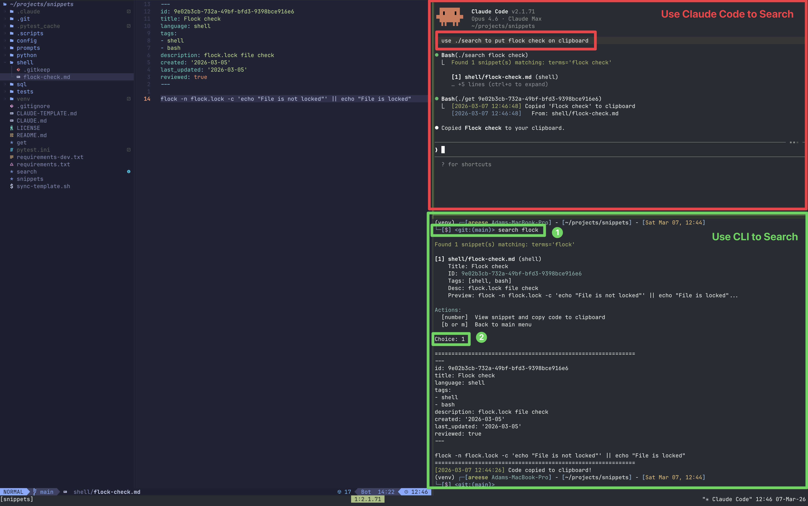
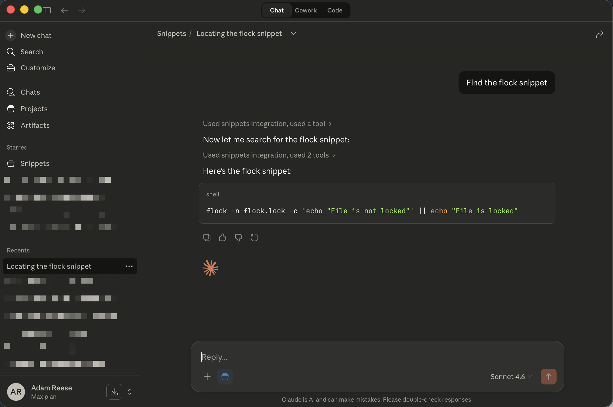

# Snippets

Personal code snippets repository with YAML frontmatter for semantic search and MCP integration.

## Quick Start

### Quick Clipboard Access (Recommended)

```bash
# Copy snippet to clipboard by UUID
./get 550e8400-e29b-41d4-a716-446655440000

# List all snippet IDs
./get --list

# Create shell aliases for frequently used snippets
alias my-snippet='~/snippets/get 550e8400-e29b-41d4-a716-446655440000'
```

### Using the TUI

```bash
cd ~/snippets
source venv/bin/activate
.scripts/snippets_tui.py  # Launch unified interface
```

### Using Individual Scripts

**Add a snippet:**

```bash
.scripts/add.py                                      # Interactive
.scripts/add.py --title "My Snippet" --language python --tags "api,rest" \
  --description "API client" --code "import requests..."
```

**Search snippets:**

```bash
.scripts/search.py --tag dbt --tag incremental      # By tags
.scripts/search.py --query "SELECT.*JOIN"            # Full-text regex
.scripts/search.py --list-tags                       # Show all tags
```

**Edit snippet:**

```bash
.scripts/edit.py                                     # Select from menu
.scripts/edit.py sql/my-snippet.md                  # Edit specific file
.scripts/edit.py sql/snippet.md --add-tags "new,tags"
```

**Audit metadata:**

```bash
.scripts/audit.py --scan                            # Find issues
.scripts/audit.py --fix-interactive                 # Fix one-by-one
```

## Setup

### Install Dependencies

**Option 1: Using uv (recommended, faster)**

```bash
# Install uv (modern Python package manager)
curl -LsSf https://astral.sh/uv/install.sh | sh

# Install dependencies
uv pip install -r requirements.txt
```

**Option 2: Using pip**

```bash
# Create virtual environment
python3 -m venv venv
source venv/bin/activate

# Install dependencies
pip install -r requirements.txt
```

### Make Scripts Executable

```bash
chmod +x .scripts/*.py
```

## Purpose

This repository stores reusable code snippets organized by language, with structured metadata for:

- Fast searching via `fzf` and `ripgrep`
- AI-powered semantic search via Claude Desktop MCP Filesystem server
- Cross-session context preservation

## Directory Structure

```
~/snippets/
├── sql/         # SQL queries, DDL, dbt models
├── python/      # Python functions, classes, utilities
├── shell/       # Bash/zsh scripts and one-liners
├── prompts/     # AI prompts and templates
├── config/      # Config file snippets (YAML, TOML, JSON)
└── .scripts/    # Automation scripts (extraction, review)
```

### Language to Directory Mapping

When you add a snippet, the `language` field determines which directory it's saved to:

| Language                        | Directory  |
| ------------------------------- | ---------- |
| `sql`                           | `sql/`     |
| `python`                        | `python/`  |
| `shell`, `bash`, `sh`           | `shell/`   |
| `yaml`, `yml`, `toml`, `json`   | `config/`  |
| `markdown`, `md`, `text`, `txt` | `prompts/` |

**Adding a new language/directory:**

1. Edit `.scripts/common.py`:
   - Add to `SUPPORTED_LANGUAGES` list
   - Add to `LANGUAGE_DIRECTORY_MAP` dictionary
2. Create the directory: `mkdir <new-directory>`
3. If using sync-template.sh, update it to include the new directory

**Unknown languages:** If you use a language not in the map, it will warn but still create a directory named after that language (e.g., `rust` → `rust/`).

## Conventions

### One Concept Per File

- Each file contains a single, focused code snippet
- Use descriptive filenames: `dbt-incremental-model.md`, `postgres-backup-script.md`
- File extension is always `.md` regardless of code language (for consistent tooling)

### Required Frontmatter

Every snippet file **must** include this YAML frontmatter:

```yaml
---
id: 550e8400-e29b-41d4-a716-446655440000 # UUID4 (auto-generated by add.py)
title: "Descriptive title for the snippet"
language: "sql" # sql | python | shell | yaml | toml | markdown | text
tags: [dbt, incremental] # Keywords for filtering and search
vars: [SCHEMA, TABLE_NAME] # Optional: variable names for interpolation
description: "One-sentence natural language description for AI semantic search"
created: "2026-03-05" # YYYY-MM-DD format
last_updated: "2026-03-05" # YYYY-MM-DD format (auto-updated by edit.py)
reviewed: true # Optional: set to true after human review
---
```

**Fields explained:**

- `id`: Unique UUID4 identifier for quick clipboard access via `get` command (auto-generated)
- `title`: Human-readable title for the snippet
- `language`: Primary language of the code (used for syntax highlighting and organization)
- `tags`: Array of keywords for filtering (lowercase, hyphen-separated)
- `vars`: Optional list of variable names for `{{VAR}}` placeholder interpolation (see [Variable Interpolation](#variable-interpolation))
- `description`: Natural language explanation of what the snippet does (optimized for AI search)
- `created`: Date snippet was added to the repository
- `last_updated`: Date snippet was last modified (automatically updated by `edit.py`)
- `reviewed`: Whether this snippet has been reviewed for accuracy (optional for manually added snippets)

### Code Content

After the frontmatter, include:

- The raw code snippet (no surrounding prose)
- Optional inline comments within the code
- No explanatory paragraphs or headers

**Example:**

```markdown
---
id: 550e8400-e29b-41d4-a716-446655440000
title: "dbt incremental model with soft deletes"
language: "sql"
tags: [dbt, incremental, snowflake, soft-delete]
description: "dbt incremental materialization pattern that handles soft-deleted records using is_incremental() macro"
created: "2026-03-05"
last_updated: "2026-03-05"
reviewed: true
---

{{
    config(
        materialized='incremental',
        unique_key='id',
        on_schema_change='fail'
    )
}}

WITH source AS (
SELECT \*
FROM {{ ref('stg_users') }}

WHERE updated_at > (SELECT MAX(updated_at) FROM {{ this }})
OR deleted_at > (SELECT MAX(updated_at) FROM {{ this }})

)

SELECT \*
FROM source
```

### Variable Interpolation

Snippets can act as templates with `{{VAR}}` placeholders. Add a `vars` field to frontmatter listing variable names eligible for interpolation:

```markdown
---
id: 550e8400-e29b-41d4-a716-446655440000
title: "Query by schema"
language: sql
tags: [sql, template]
vars: [SCHEMA, TABLE_NAME, START_DATE]
description: "Parameterized query with schema and date filtering"
created: "2026-03-12"
last_updated: "2026-03-12"
---

SELECT * FROM {{SCHEMA}}.{{TABLE_NAME}}
WHERE created_at > '{{START_DATE}}'
```

**Resolution order** (per variable, highest priority first):

1. CLI flag: `--var NAME=value`
2. Environment variable: `os.environ['NAME']`
3. Unresolved: left as `{{NAME}}` in output

**Creating a template snippet:**

```bash
.scripts/add.py \
  --title "Query by Schema" \
  --language sql \
  --tags "sql,template" \
  --vars "SCHEMA,TABLE_NAME,START_DATE" \
  --description "Parameterized query with schema and date filtering" \
  --code "SELECT * FROM {{SCHEMA}}.{{TABLE_NAME}} WHERE created_at > '{{START_DATE}}'"
```

**Retrieving with interpolation:**

```bash
# Env vars resolve automatically
export SCHEMA=public
./get <uuid> --print

# Override with CLI flags
./get <uuid> --var SCHEMA=staging --var START_DATE=2026-01-01

# Skip interpolation
./get <uuid> --raw
```

**Stderr feedback:** When a snippet has `vars`, a resolution summary is printed to stderr (doesn't affect clipboard or piping):

```
Resolved: SCHEMA (env), TABLE_NAME (flag)
Unresolved: START_DATE
```

**dbt/Jinja safety:** Only names listed in `vars` are interpolated. Jinja expressions like `{{ ref('stg_users') }}` are never touched because those names won't be in `vars`.

**Undeclared placeholder hints:** If the output contains `{{UPPER_CASE}}` patterns not listed in `vars`, a stderr hint suggests adding them. Lowercase/mixed-case patterns (Jinja) are ignored.

## Usage



### Command-Line Search

**Find snippets by keyword:**

```bash
cd ~/snippets
rg -i "incremental" --type md
```

**Fuzzy find and preview:**

```bash
cd ~/snippets
fzf --preview 'cat {}'
```

**Search within frontmatter:**

```bash
rg "^tags:.*dbt" --type md
```

### Claude for Desktop MCP Integration

This repository is designed for deep integration with [Claude for Desktop](https://claude.ai/download) via the [MCP Filesystem server](https://github.com/modelcontextprotocol/servers/tree/main/src/filesystem). Once connected, Claude can read, search, and manage your snippets directly — no copy-paste required.

#### How It Works

Claude uses two capabilities together:

1. **MCP Filesystem** — Gives Claude direct read access to `.md` files in the repo so it can read `CLAUDE.md`, inspect frontmatter, and retrieve snippet content.
2. **Script-driven CRUD** — For write operations (add, edit, audit), Claude calls the `.scripts/` Python scripts, which handle UUID generation, git commits, and metadata validation.

This means Claude can both _find_ and _manage_ your snippets in a single session.

#### Step 1: Prerequisites

The MCP Filesystem server is delivered via `npx` — no separate install needed. Verify Node.js is available:

```bash
node --version  # Should be v18+
```

#### Step 2: Configure Claude for Desktop

Edit (or create) your Claude Desktop config file:

- **macOS**: `~/Library/Application Support/Claude/claude_desktop_config.json`
- **Windows**: `%APPDATA%\Claude\claude_desktop_config.json`

Add a `snippets` entry under `mcpServers`, pointing to the **absolute path** of this repository:

```json
{
  "mcpServers": {
    "snippets": {
      "command": "npx",
      "args": [
        "-y",
        "@modelcontextprotocol/server-filesystem",
        "/path/to/your/snippets"
      ]
    }
  }
}
```

Replace `/path/to/your/snippets` with the actual path (e.g. `/Users/yourname/projects/snippets`).

If you have other MCP servers already configured, add `snippets` alongside them inside the existing `mcpServers` object.

#### Step 3: The CLAUDE.md Integration Guide

This repository includes a `CLAUDE.md` file that Claude reads automatically at the start of each session. It teaches Claude:

- The frontmatter schema and what each field means
- How to use the `.scripts/` CRUD system (`add.py`, `search.py`, `edit.py`, `audit.py`, `get.py`)
- How to avoid duplicates, validate metadata, and commit safely
- Workflow patterns for common operations

Review `CLAUDE.md` and update any paths or workflow notes to match your setup before connecting Claude.

#### Step 4: Restart Claude for Desktop

Fully quit and relaunch Claude for Desktop after editing the config. The `snippets` filesystem server should appear as a connected tool.

#### Step 5: Orient Claude at the Start of Each Session

Begin your conversation by pointing Claude to the orientation files:

```
You are helping manage my personal snippets repo. Please read
/path/to/your/snippets/CLAUDE.md and /path/to/your/snippets/README.md
to get your bearings.
```

After that, Claude will use the scripts and conventions in `CLAUDE.md` for all operations in the session.

> **Tip:** Add this instruction to a Claude Project's system prompt so you don't have to repeat it every conversation. Set the project context once and every new chat starts already oriented.

#### Example



#### Example Prompts

```
# Find snippets
"Do I have any snippets for flock file locking?"
"Show me all my SQL snippets tagged with 'dbt'"
"Find shell scripts related to backups"

# Retrieve and print snippet content
"Get my QA data load snippet and print it"
"Show me all my QA query snippets"

# Add snippets
"Save this Python function as a snippet — tag it api and retry"
"Add the code I just wrote to my snippets repo"

# Maintain snippets
"Check my snippets for any metadata issues"
"Update the description on my flock snippet"
"Add the tag 'reviewed' to the cinch-qa-locations snippet"
```

## System Paradigm

This repository implements a **script-driven snippet management system** designed for:

### Dual-Mode Operation

- **Interactive Mode**: Menu-driven prompts for human users
- **Programmatic Mode**: JSON/CLI arguments for AI agents (Claude Code)

### Metadata-First Design

Every snippet includes structured YAML frontmatter for:

- **Semantic search**: AI-optimized descriptions
- **Filtering**: Tags, language, date range
- **Organization**: Automatic directory routing
- **Tracking**: Creation and update timestamps

### Script-Based CRUD

- **Create**: `add.py` - Interactive or programmatic snippet creation
- **Read**: `search.py` - Multi-filter search with previews
- **Update**: `edit.py` - Metadata editing with auto-timestamping
- **Delete**: Manual deletion (use `git rm`)
- **Audit**: `audit.py` - Metadata completeness scanning

### Git-Integrated

All operations prompt before committing (in interactive mode):

- `feat(language): add <title>` - New snippets
- `chore(language): update <filename> metadata` - Edits

### AI-Friendly

- **MCP Integration**: Expose via Filesystem MCP server
- **JSON Output**: All scripts support `--format json`
- **Structured Metadata**: Searchable by AI agents
- **Clear Conventions**: Consistent patterns across all scripts

## Scripts Reference

### `snippets_tui.py` - Unified Terminal Interface

Menu-driven access to all snippet operations.

**Usage:**

```bash
.scripts/snippets_tui.py
```

**Menu Options:**

- [a] Add new snippet
- [s] Search snippets
- [e] Edit snippet
- [d] Delete snippet
- [r] Recent snippets
- [b] Browse all
- [t] Tag management
- [u] Audit metadata
- [i] Info/stats
- [q] Quit

### `get.py` (or `get`) - Quick Snippet Access

Retrieve snippets by UUID and copy to clipboard. Supports [variable interpolation](#variable-interpolation) for template snippets.

**Usage:**

```bash
# Copy snippet to clipboard
./get 550e8400-e29b-41d4-a716-446655440000
.scripts/get.py 550e8400-e29b-41d4-a716-446655440000

# Print to stdout (for piping)
./get 550e8400-e29b-41d4-a716-446655440000 --print

# With variable overrides (for snippets with vars field)
./get 550e8400-e29b-41d4-a716-446655440000 --var SCHEMA=staging --var TABLE_NAME=users

# Skip interpolation entirely
./get 550e8400-e29b-41d4-a716-446655440000 --raw

# List all snippet IDs
./get --list
.scripts/get.py --list --format json
```

**Shell Alias Pattern:**

```bash
# Add to ~/.zshrc for global access
alias get='~/snippets/get'

# Create one-shot aliases for frequently used snippets
alias my-query='get 550e8400-e29b-41d4-a716-446655440000'
alias my-script='get 123e4567-e89b-12d3-a456-426614174000'

# Env vars fill in placeholders automatically
export SCHEMA=public
alias qa-query='~/snippets/get abc123-def456'
```

### `add.py` - Create Snippets

Add new snippets with auto-suggested metadata (auto-generates UUID).

**Interactive Mode:**

```bash
.scripts/add.py
# Paste code (Ctrl+D to finish)
# Answer prompts for title, language, tags, description
```

**Programmatic Mode:**

```bash
# JSON input
.scripts/add.py --json '{"title": "...", "code": "...", "language": "sql"}'

# CLI arguments
.scripts/add.py \
  --title "API Client" \
  --language python \
  --tags "api,rest,client" \
  --description "Reusable API client with retry logic" \
  --code "import requests..."

# Read from file
.scripts/add.py --title "My Script" --language python --code-file script.py

# Template snippet with variable placeholders
.scripts/add.py \
  --title "Query by Schema" \
  --language sql \
  --tags "sql,template" \
  --vars "SCHEMA,TABLE_NAME" \
  --description "Parameterized query" \
  --code "SELECT * FROM {{SCHEMA}}.{{TABLE_NAME}}"
```

**Features:**

- Auto-detect language from code
- Auto-suggest tags based on content
- Frontmatter validation
- Template snippets with `--vars` for [variable interpolation](#variable-interpolation)
- Preview before saving
- Optional git commit

### `search.py` - Find Snippets

Multi-filter search with structured output.

**Usage:**

```bash
# Interactive mode
.scripts/search.py

# Filter by tags (AND logic)
.scripts/search.py --tag dbt --tag incremental

# Filter by language
.scripts/search.py --language sql

# Full-text regex search
.scripts/search.py --query "SELECT.*JOIN"

# Recently updated (last 7 days)
.scripts/search.py --recently-updated 7

# Multiple filters with JSON output
.scripts/search.py --tag dbt --language sql --format json

# List all tags with counts
.scripts/search.py --list-tags
```

**Features:**

- Tag, language, text, regex, and date filtering
- AND logic for multiple filters
- Interactive results viewer
- JSON output for programmatic use

### `edit.py` - Update Metadata

Edit snippet metadata and code.

**Interactive Mode:**

```bash
.scripts/edit.py                    # Select from menu
.scripts/edit.py sql/snippet.md     # Edit specific file
```

**Programmatic Mode:**

```bash
# JSON updates
.scripts/edit.py sql/snippet.md --json '{"tags": ["new", "tags"]}'

# Single field update
.scripts/edit.py sql/snippet.md --update-field description --value "New description"

# Tag operations
.scripts/edit.py sql/snippet.md --add-tags "tag1,tag2"
.scripts/edit.py sql/snippet.md --remove-tags "old-tag"
```

**Features:**

- Auto-update `last_updated` field
- Schema migration (remove `source`, add `last_updated`)
- Edit code in $EDITOR
- Fill missing fields
- Frontmatter validation

### `audit.py` - Validate Metadata

Scan and fix metadata issues.

**Usage:**

```bash
# Scan for issues (dry-run)
.scripts/audit.py --scan

# Interactive fix mode (one-by-one)
.scripts/audit.py --fix-interactive

# Auto-migrate old schema (includes adding UUIDs)
.scripts/audit.py --migrate-schema

# Add UUIDs to existing snippets
.scripts/audit.py --add-uuids

# Check specific directory
.scripts/audit.py --scan --directory sql

# JSON output
.scripts/audit.py --scan --format json
```

**Detects:**

- Missing UUID (id field)
- Missing required fields
- Empty values
- Invalid date formats
- Old schema (has `source`, missing `last_updated`)
- Invalid language
- Malformed tags

## Git Workflow

### Committing Snippets

Use conventional commit format:

```bash
git commit -m "feat(sql): add dbt incremental model with soft deletes"
git commit -m "feat(python): add API retry decorator with exponential backoff"
git commit -m "feat(shell): add postgres backup script with compression"
```

### Syncing to Remote

```bash
# First time only
git remote add origin <your-repo-url>
git branch -M main
git push -u origin main

# Subsequent pushes
git push
```

## Bootstrap on New Machines

Add to your dotfiles `setup.sh`:

```bash
# Clone snippets repo
if [ ! -d "$HOME/snippets" ]; then
  git clone <your-repo-url> "$HOME/snippets"
fi
```
